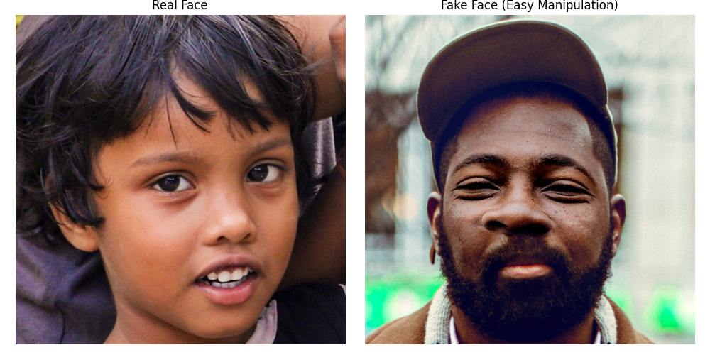

# Real vs Fake Face Detection

This project utilizes Deep Learning techniques to distinguish between real human face images and digitally manipulated (fake/photoshopped) ones. It implements both a custom Convolutional Neural Network (CNN) and a Transfer Learning approach using the VGG16 architecture.


*Figure 1: Comparison between a real face and a manipulated (fake) face from the dataset.*

## 📌 Overview

With the rise of sophisticated image editing tools, detecting manipulated faces has become a critical task in digital forensics and security. This project provides a pipeline to:
1.  Load and preprocess a dataset of real and fake faces.
2.  Train deep learning models (Custom CNN & VGG16).
3.  Perform inference to classify new images.

## 📊 Dataset

The project uses the **Real and Fake Face Detection** dataset from Kaggle.
- **Source:** [Kaggle Dataset Link](https://www.kaggle.com/datasets/ciplab/real-and-fake-face-detection)
- **Content:** 
  - `training_real`: Original, unedited face images.
  - `training_fake`: Images with various levels of expert manipulation (easy, medium, hard).

## 🚀 Installation

1.  **Clone the repository:**
    ```bash
    git clone <repository-url>
    cd Real-Fake-Face-Detection
    ```

2.  **Install dependencies:**
    Ensure you have Python 3.10+ installed.
    ```bash
    pip install tensorflow numpy matplotlib pillow
    ```

## 🛠 Usage

### 1. Training the Models
Open `Train_Models.ipynb` to train the models from scratch. 
- The notebook is optimized for memory safety (smaller batch sizes and image resolutions).
- It trains both a standard CNN and a VGG16-based model.
- Models are saved to the `Trained_Models/` directory.

### 2. Running Inference
Open `Real_Fake_Face_Detection.ipynb` to test the pre-trained models.
- Load the model from the `Models/` folder.
- Run the prediction function on any image from the dataset.
- Visualize the output with probability scores.

## 🏗 Model Architectures

### Custom CNN
A simple sequential model featuring:
- Rescaling layer (Normalization).
- Multiple Conv2D and MaxPooling2D layers.
- Dense layers with ReLU activation.
- Sigmoid output for binary classification.

### VGG16 (Transfer Learning)
- Uses pre-trained weights from ImageNet.
- Frozen base layers.
- Custom dense head for the specific real/fake classification task.

## 📈 Results
The models achieve competitive accuracy in distinguishing manipulations. Detailed training history (accuracy/loss plots) can be found within the `Train_Models.ipynb` notebook.

---
*Created as part of a Machine Learning exploration into image forensics.*
